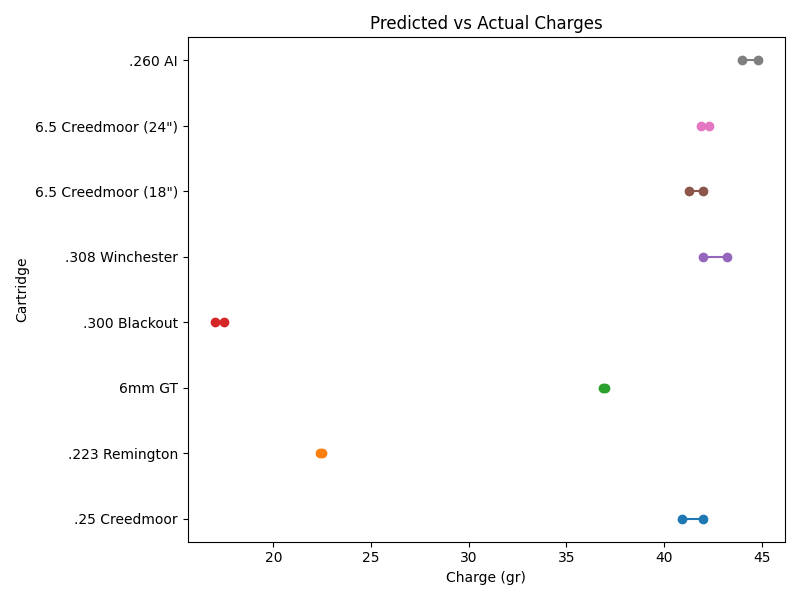
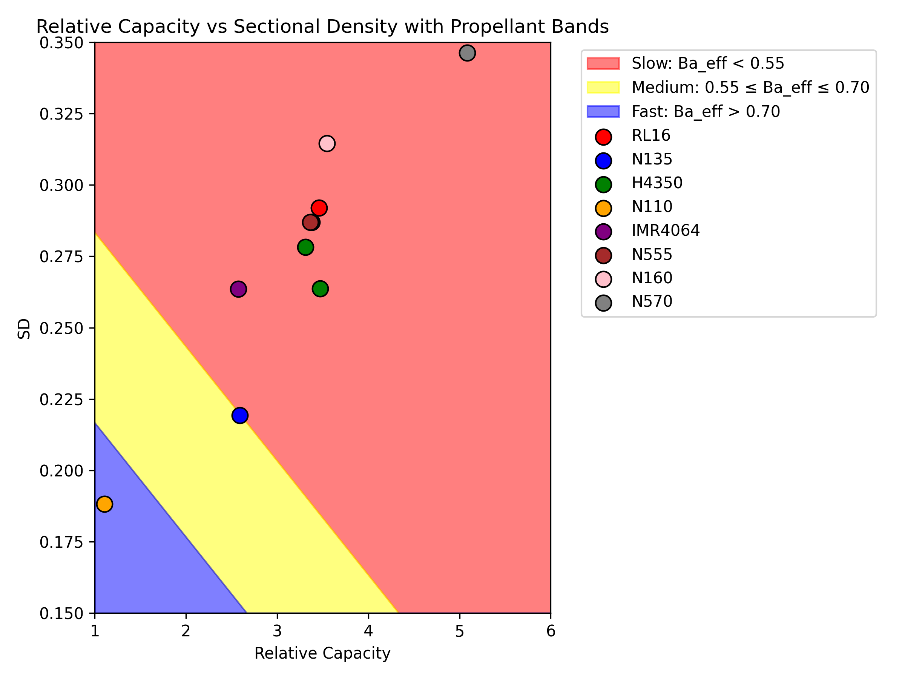

# Algebraic Propellant Selection: A Modern Empirical Framework

This project develops a simple algebraic transfer function for propellant selection and load optimization in rifle cartridges. Leveraging empirical data from verified high-performance loads, it predicts suitable commercially available propellants, optimal charge weights, and key performance metrics. The system flags mismatches where no commercial powder achieves desired criteria (load density ≥95%, near-complete burnout, safe peak pressures ~55,000–60,000 PSI).

Building on Homer Powley's 1960s slide-rule tool, it updates for modern temperature-stable powders (Vihtavuori, Alliant, Hodgdon, IMR), high-density loads, and precise PSI targets. Core calculations involve expansion ratio, sectional density, and mass ratios to select propellants and predict charges.

## Usage

### Scripts

The project includes several Python scripts in the `scripts/` directory for data processing and analysis. Ensure you have Python 3 and required libraries (pandas, numpy, matplotlib) installed.

- `parse_grt_cartridge.py`: Parses GRT .grtload XML files to extract cartridge data into `data/cartridge_data_from_grt.csv`.
- `parse_grt_prop.py`: Parses GRT .grtload XML files to extract propellant parameters into `data/propellant_params.csv`.
- `compute_ba_eff.py`: Computes ballistic efficiency (Ba_eff) for propellants and updates `data/propellant_params.csv`.
- `compute_predictions.py`: Computes predicted charge masses from `data/CartridgeData.csv` and outputs to `data/Predictions.csv` using the empirical formula.
- `calculate_metrics.py`: Calculates derived metrics like efficiency proxy and mass ratio.
- `calculate_charge.py`: Calculates expansion ratios and predicted charges.
- `analysis.py`: Performs statistical analysis on the datasets.
- `create_db.py`: Creates a SQLite database from CartridgeData.csv.
- `plot_data.py`: Generates various plots and analysis from the data, saving to `plots/`.
- `plot_rc_bulletweight.py`: Plots relative capacity vs. bullet weight with Ba_eff bands.
- `plot_rc_sd.py`: Plots relative capacity vs. sectional density with Ba_eff bands.
- `propellant_selector.py`: Interactive CLI tool for propellant selection based on user inputs, with dynamic data loading, ranking, and optional summary output.

Run a script with: `python scripts/script_name.py`

### Jupyter Notebook

The project includes a Jupyter notebook (`demo.ipynb`) for an interactive demo combining data loading, calculations, and plotting.

Run with: `jupyter notebook jupyter/demo.ipynb`

### Data

- `data/CartridgeData.csv`: Main cartridge data.
- `data/cartridge_data_from_grt.csv`: Parsed cartridge data from GRT files.
- `data/Predictions.csv`: Predicted vs actual charges.
- `data/ExpansionRatio.csv`: Expansion ratios.
- `data/propellant_params.csv`: Extracted propellant parameters.
- `data/derived_metrics.csv`: Derived metrics like efficiency proxy.
- `data/calculated_metrics.csv`: Calculated metrics and charges.

## Key Visualizations

*Proof of accuracy: Predictions within ~1 grain of actual loads.*

*Relative Capacity (RC) vs. Sectional Density (SD) plot with Ba_eff bands for propellant selection.*

## Documentation

- [Introduction](docs/Introduction.md) - Full overview, hypothesis, assumptions, and calculations
- [Equations](docs/Equations.md) - Detailed formulas, propellant table, and derivations
- [Current Findings](docs/Current_Findings.md) - Validation results and discussion
- [History](docs/History.md) - Account of the Powley Computer development
- [Usage Instructions](docs/Usage_Instructions.md) - Step-by-step guide to using the scripts
